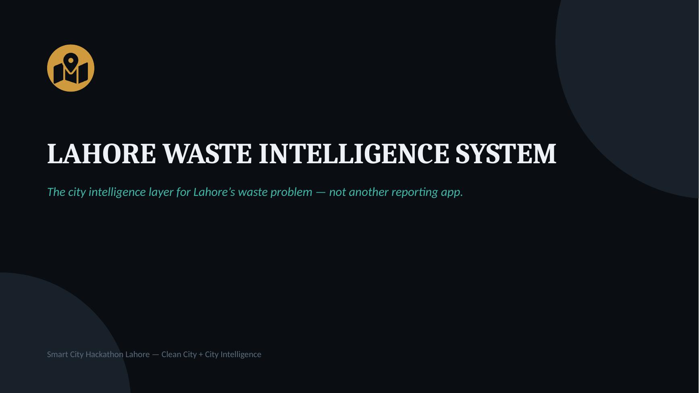
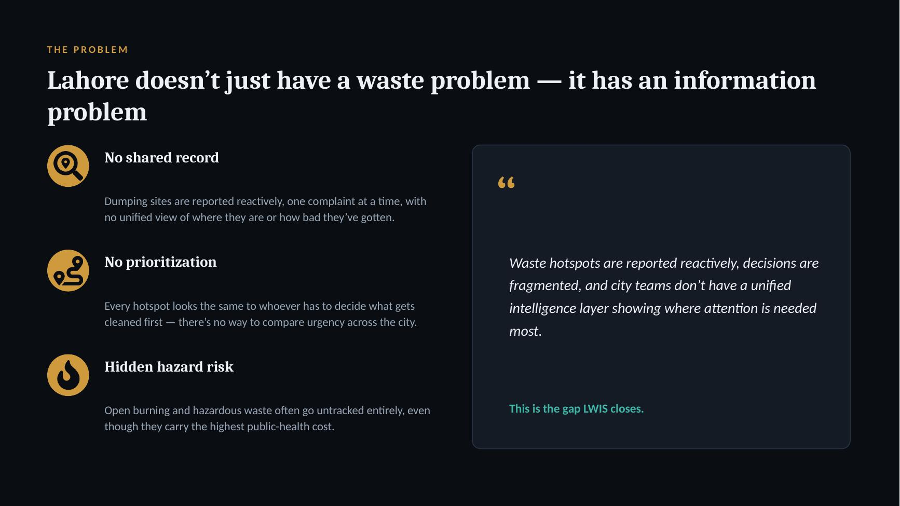
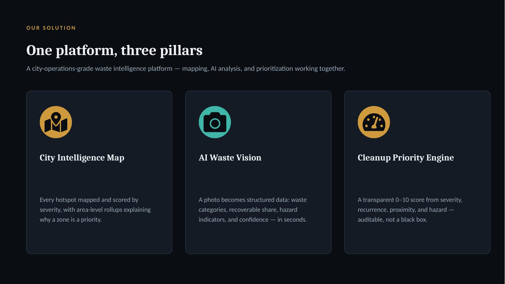
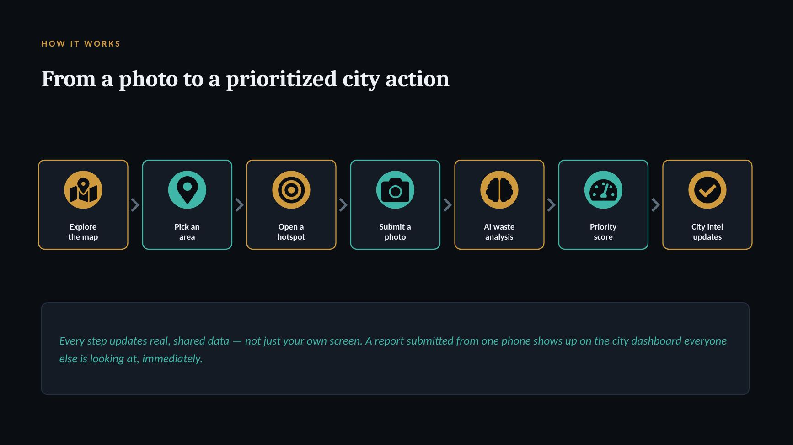
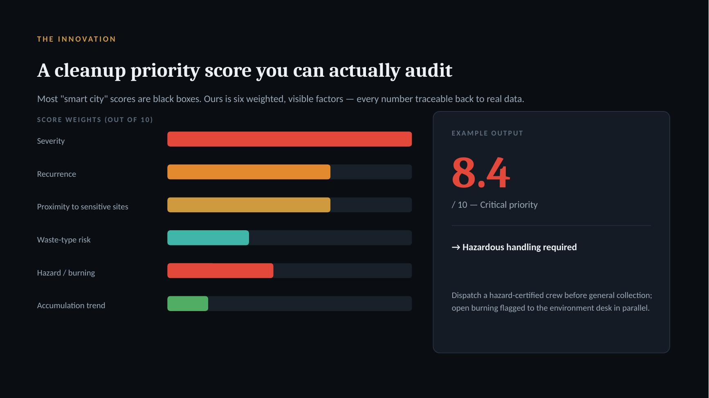
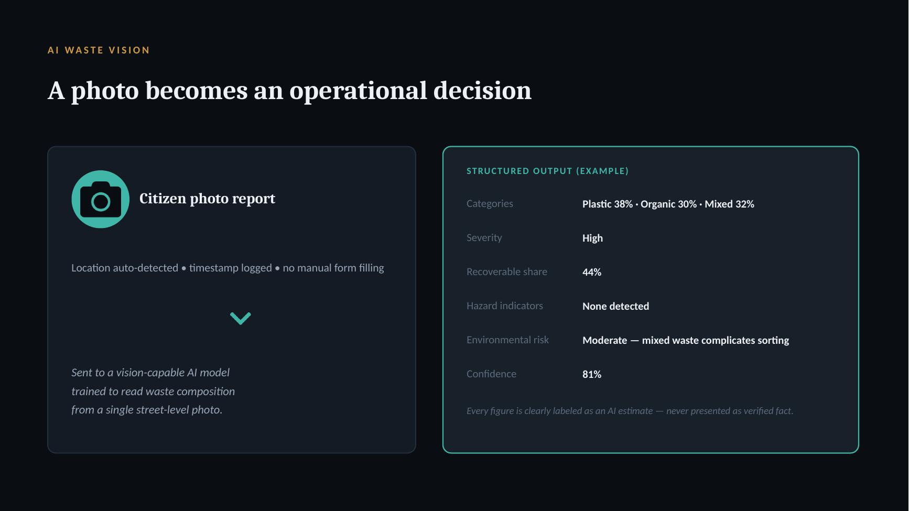
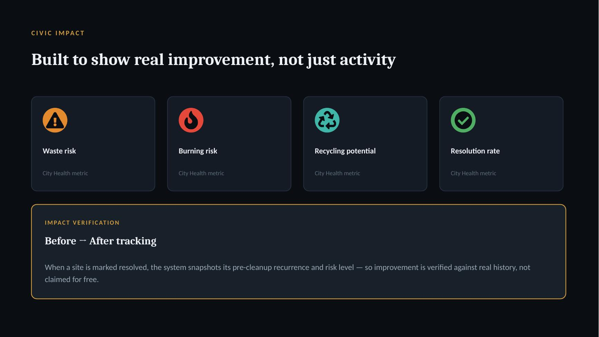
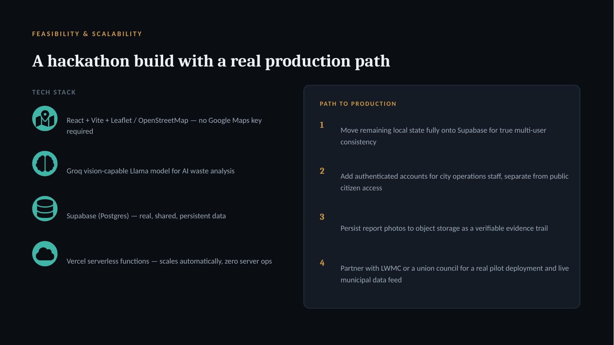
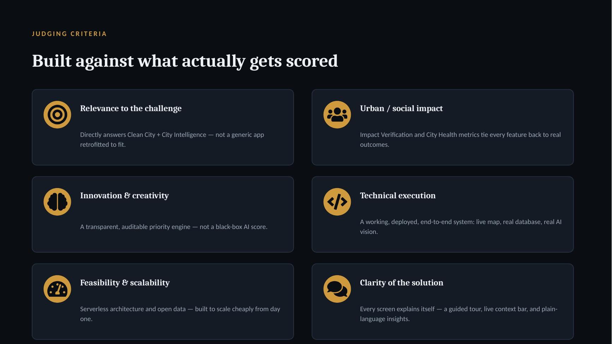
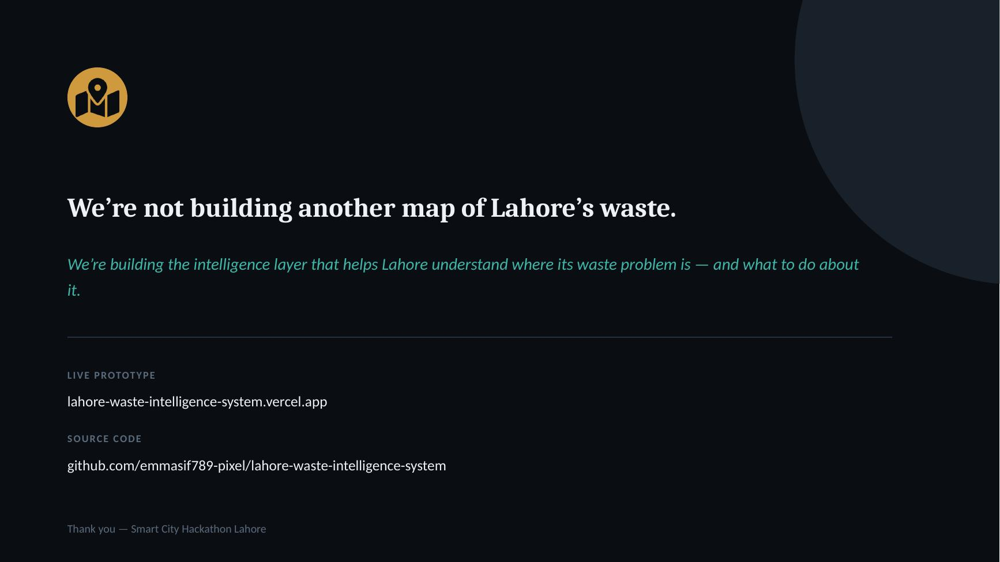

# 🗺️ Lahore Waste Intelligence System (LWIS)

**A city intelligence platform for Lahore's waste problem — not another reporting app.**

Built for **Smart City Hackathon Lahore 2026**, addressing both the **Clean City** and **City Intelligence** challenge themes.

🔗 **Live prototype:** [lahore-waste-intelligence-system.vercel.app](https://lahore-waste-intelligence-system.vercel.app)
💻 **Source code:** this repository
📊 **Pitch deck:** [`/docs/lwis_pitch_deck.pptx`](./docs/lwis_pitch_deck.pptx)
🎥 **Demo video:** _link added at submission_

---

## The problem

Lahore doesn't just have a waste problem — it has an **information problem**.

Dumping sites get reported one complaint at a time, with no shared record of where they are, how bad they've become, or whether anything is actually being done about them. Every hotspot looks the same to whoever has to decide what gets cleaned first — there's no way to compare urgency across the city. Hazards like open burning routinely go untracked entirely, even though they carry the highest public-health cost of all.

The result: cleanup decisions are made reactively and blind, and the same sites re-accumulate again and again with no institutional memory of the pattern.

## Why it matters

Uncollected waste in dense urban neighborhoods isn't just an eyesore — it's a public-health and environmental hazard. Standing organic waste attracts pests and can contaminate soil and water. Open burning releases particulate matter that measurably degrades air quality for nearby residents, disproportionately affecting people living closest to informal dump sites — often the same communities with the least ability to advocate for cleanup. Without shared, prioritized data, limited municipal cleanup resources get spent reactively instead of where they'd have the greatest impact.

## Our solution

LWIS turns scattered citizen reports into a **prioritized, auditable, city-wide intelligence layer**:

| Pillar | What it does |
|---|---|
| 🗺️ **City Intelligence Map** | Every waste hotspot mapped and color-coded by severity, with area-level rollups explaining *why* a neighborhood is a priority zone in plain language |
| 📸 **AI Waste Vision** | A citizen photo becomes structured data in seconds: waste category breakdown, recoverable material share, hazard indicators, and a confidence score |
| 🎯 **Cleanup Priority Engine** | A transparent, deterministic 0–10 score built from severity, recurrence, proximity to sensitive sites, waste-type risk, hazard presence, and accumulation trend — every number traceable back to real inputs, not a black box |
| ✦ **City Intelligence panel** | Answers real operational questions — *"what should we clean first," "where's the risk today"* — computed live from tracked data, not a chatbot guessing |
| 📊 **Civic Impact tracking** | City Health metrics (waste risk, burning risk, recycling potential, resolution rate) and **Impact Verification** — a real before/after snapshot captured when a site is marked resolved, so improvement is verified against history, not just claimed |

### Who benefits

- **Residents** get a shared, transparent view of waste conditions in their neighborhood instead of filing complaints into a void
- **City operations staff / LWMC-style teams** get a ranked, explainable dispatch queue instead of reacting to whichever complaint arrived most recently
- **Policy and planning stakeholders** get aggregate city-health metrics that reveal systemic patterns (which areas recur, which have the worst burning risk) rather than isolated incidents

## What makes this genuinely different

Most hackathon "waste apps" stop at a reporting form. LWIS is deliberately built as **infrastructure, not a form**:

- The priority score is **fully auditable** — every weight (severity, recurrence, proximity, hazard, trend) is visible and traceable, unlike opaque AI-scored systems judges see elsewhere.
- **Impact is verified, not narrated** — resolving a hotspot snapshots its pre-cleanup state, so before/after comparisons are backed by real data transitions, not marketing claims.
- Data is **real and shared**, backed by a live Postgres database (Supabase) — not per-browser localStorage that only the demo presenter can see.
- The system is explicit about what's real: seeded demo data is clearly labeled as such everywhere in the UI, and the AI vision pipeline honestly discloses when it's running a live model versus a fallback heuristic — no fabricated confidence.
- It sits at the intersection of **both** challenge themes simultaneously: Clean City (the waste/pollution problem itself) and City Intelligence (the AI/data/mapping layer that makes the problem tractable) — not shoehorned into one track.

## How it works — the full loop

```
Explore the map → Pick an area → Open a hotspot → Submit a photo
→ AI waste analysis → Cleanup priority score → Recommended action
→ City intelligence updates for everyone, live
```

A report submitted from one phone updates the shared database immediately — every other visitor sees the change, not just the person who submitted it.

## Pitch deck

<sub>Full presentation: [`/docs/lwis_pitch_deck.pptx`](./docs/lwis_pitch_deck.pptx)</sub>

<table>
<tr>
<td></td>
<td></td>
</tr>
<tr>
<td></td>
<td></td>
</tr>
<tr>
<td></td>
<td></td>
</tr>
<tr>
<td></td>
<td></td>
</tr>
<tr>
<td></td>
<td></td>
</tr>
</table>

## Impact and scalability

The architecture is chosen specifically to scale cheaply:

- **Vercel serverless functions** — no server to provision, scales automatically with load
- **OpenStreetMap + Nominatim** — no Google Maps API key or per-request billing ceiling
- **Groq vision-capable Llama model** — fast, low-cost AI inference for photo analysis
- **Supabase (Postgres)** — a real, shared, persistent database with Row Level Security, not a demo hack

**Honest gap between pilot and production**, stated plainly rather than hidden:

1. Authenticated accounts for city operations staff, separate from public citizen access (currently a UI toggle, not real auth)
2. Persist report photos to object storage as a verifiable evidence trail
3. A real partnership with LWMC or a union council for a live municipal data feed, replacing the current clearly-labeled demo dataset

## Technology

| Layer | Choice |
|---|---|
| Frontend | React 18 + Vite |
| Mapping | Leaflet + OpenStreetMap tiles, Nominatim reverse geocoding |
| AI vision | Groq API (Llama 4 Scout, vision-capable), with an honest on-device heuristic fallback when no key is configured |
| Backend | Vercel serverless functions (`/api/analyze`) |
| Database | Supabase (Postgres) with Row Level Security |
| Deployment | Vercel, auto-deployed from this repository |

## Run it locally

```bash
npm install
npm run dev
```

## Enable the live AI vision model

Set `GROQ_API_KEY` in Vercel → Project Settings → Environment Variables, then redeploy. `/api/analyze` automatically switches from the heuristic fallback to Groq's live vision model — no code changes needed.

## Database schema

See [`supabase/schema.sql`](./supabase/schema.sql) — mirrors the shape consumed by `src/lib/store.js`, including Row Level Security policies for public read/write (appropriate for a hackathon demo; tightened before any real production rollout, as noted in the schema comments).

## Project structure

```
src/
  components/     UI components (map, dashboard, report flow, city intelligence, tour)
  lib/            Priority engine, area intelligence, AI analysis, Supabase client, exports
  data/           Seed demo dataset (clearly labeled as such throughout the UI)
api/
  analyze.js      Vercel serverless function — Groq vision analysis endpoint
supabase/
  schema.sql      Database schema with RLS policies
```

---

**Smart City Hackathon Lahore 2026** · Clean City + City Intelligence tracks
